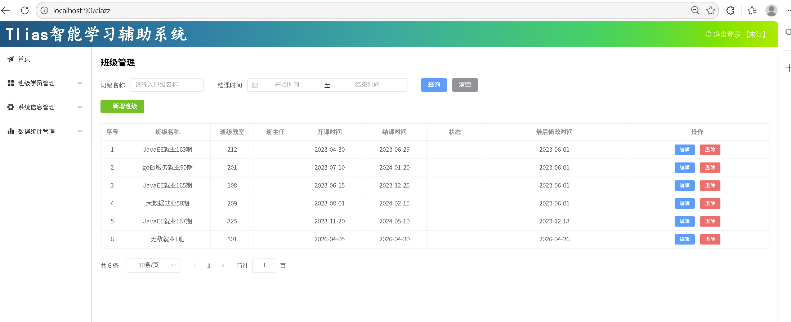
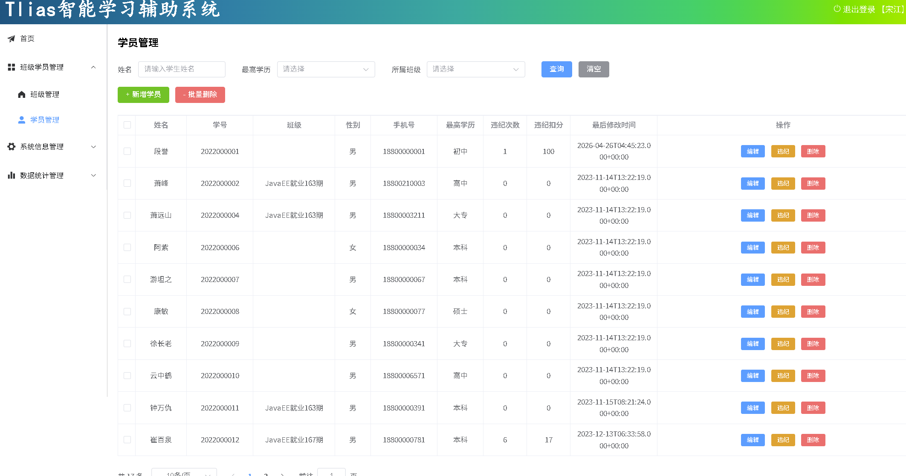
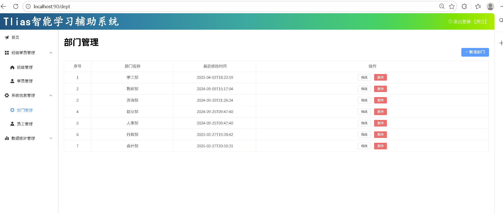
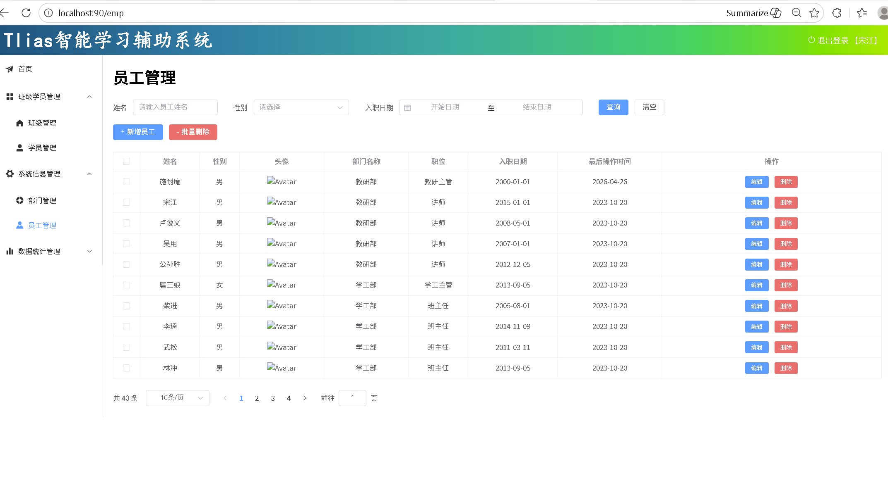
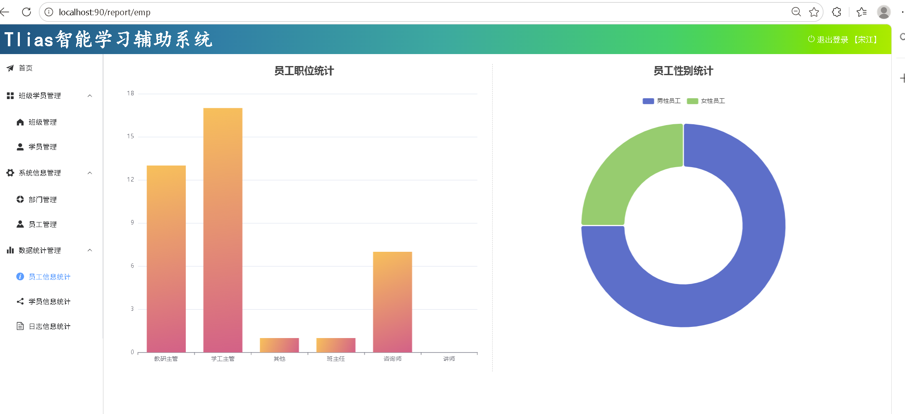
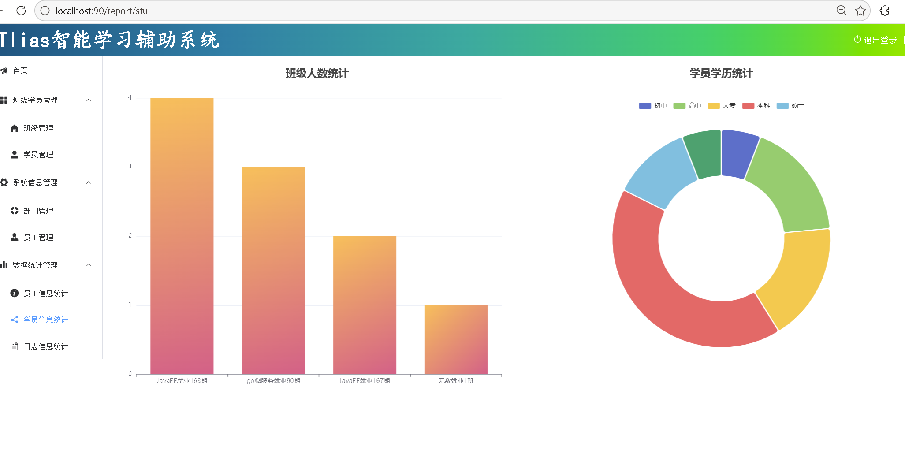
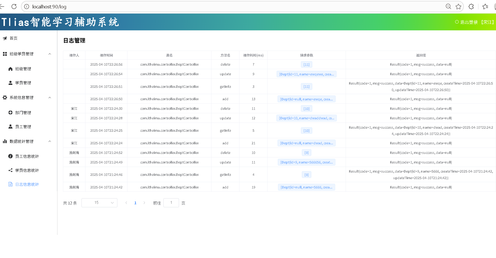

# Tlias 智能学习辅助系统

## 项目简介

Tlias 是一个企业级的智能学习辅助管理系统，实现了员工管理、班级管理、学生管理、数据统计等功能。

## 项目截图

| 功能模块 | 截图 |
|---------|------|
| 首页 |  |
| 员工管理 |  |
| 部门管理 |  |
| 班级管理 |  |
| 学生管理 |  |
| 数据统计 |  |
| 日志管理 |  |

## 技术栈

- **后端**：
  - Spring Boot 3.5.13
  - MyBatis-Plus 3.5.5
  - MySQL
  - JWT（身份认证）
  - Lombok

- **前端**：
  - Vue.js（打包后）
  - Nginx（反向代理）

## 项目功能

### 1. 登录模块
- 员工登录
- JWT 令牌认证

### 2. 部门管理
- 部门列表查询
- 部门新增
- 部门修改
- 部门删除

### 3. 员工管理
- 员工列表查询（条件分页）
- 员工新增
- 员工修改
- 员工删除
- 员工工作经历管理

### 4. 班级管理
- 班级列表查询（条件分页）
- 班级新增
- 班级修改
- 班级删除

### 5. 学生管理
- 学生列表查询（条件分页）
- 学生新增
- 学生修改
- 学生删除

### 6. 数据统计
- 员工性别统计
- 员工职位统计
- 学员学历统计
- 班级人数统计

### 7. 日志管理
- 操作日志分页查询

### 8. 文件上传
- 图片文件上传

## 项目结构

```
tlias/
├── src/
│   ├── main/
│   │   ├── java/com/ascit/tlias/
│   │   │   ├── controller/  # 控制器层
│   │   │   ├── service/     # 服务层
│   │   │   ├── mapper/      # 持久层
│   │   │   ├── entity/      # 实体类
│   │   │   ├── result/      # 统一响应结果
│   │   │   ├── config/      # 配置类
│   │   │   └── utils/       # 工具类
│   │   └── resources/
│   │       ├── application.properties  # 配置文件
│   │       └── *.xml                    # MyBatis映射文件
├── nginx-1.22.0-web/  # Nginx配置和前端代码
├── images/            # 项目截图
├── tlias.sql          # 数据库脚本
├── README.md          # 项目说明
└── pom.xml            # Maven配置
```

## 快速开始

### 1. 环境准备

- JDK 17+
- Maven 3.6+
- MySQL 8.0+
- Nginx 1.22+

### 2. 数据库配置

1. 创建数据库 `mydatabase`
2. 执行 `tlias.sql` 脚本，导入表结构和数据
3. 修改 `src/main/resources/application.properties` 中的数据库配置：

```properties
spring.datasource.url=jdbc:mysql://你的数据库地址:端口/mydatabase
spring.datasource.username=你的用户名
spring.datasource.password=你的密码
```

### 3. 后端启动

```bash
# 方式1：Maven命令
mvn spring-boot:run

# 方式2：直接运行主类
运行 TliasApplication.java
```

后端服务地址：`http://localhost:8080`

### 4. Nginx配置和启动

1. 查看 `nginx-1.22.0-web/conf/nginx.conf` 配置
2. 修改配置中的端口和代理地址（如果需要）
3. 启动 Nginx：

```bash
cd nginx-1.22.0-web
nginx.exe
```

前端访问地址：`http://localhost`（或你配置的端口）

## 使用说明

### 接口文档

主要接口路径：
- 登录：`POST /login`
- 部门管理：`/depts`
- 员工管理：`/emps`
- 班级管理：`/clazzs`
- 学生管理：`/students`
- 数据统计：`/report`
- 日志管理：`/log`
- 文件上传：`POST /upload`

### 注意事项

- 登录后会返回 JWT 令牌，后续请求需要在请求头中携带 `token` 字段
- 上传的文件默认保存在项目根目录的 `uploads` 文件夹

## 项目亮点

1. **MyBatis-Plus 简化开发**：使用 MyBatis-Plus 提高开发效率
2. **统一响应结果**：封装了统一的 Result 类
3. **JWT 身份认证**：使用 JWT 令牌实现无状态认证
4. **条件分页查询**：实现了复杂的条件分页查询功能
5. **数据统计功能**：提供了丰富的数据统计报表
6. **Nginx 反向代理**：解决跨域问题，提升性能
7. **完整的CRUD功能**：实现了完整的增删改查功能

## 作者

ASCIT

## 许可证

MIT License
